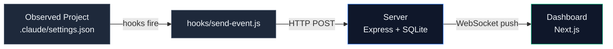

# Claude Code Observability

> See every tool call, every sub-agent, every wait — in one swimlane.

A local observability dashboard for [Claude Code](https://docs.claude.com/claude-code) multi-agent sessions. Hooks capture every tool invocation, prompt, and sub-agent activity in real time; the dashboard renders them as a live event stream and a 5-minute scrolling swimlane.

[中文版 / Chinese version](README.zh.md)


*Swimlane view: each agent gets its own row, time flows left to right.*

## Features

- **Real-time event stream** — WebSocket push, no polling. Sub-second latency from hook fire to dashboard render.
- **Two views, one source of truth** — Vertical list for chronological reading, horizontal swimlane (5-min sliding window) for multi-agent coordination patterns.
- **Pre/Post tool call pairing** — Match `PreToolUse` + `PostToolUse` events into single rows with elapsed time. Running tools show a live counter.
- **Sub-agent visibility** — `SubagentStart` / `SubagentStop` automatically pair into one row with total duration.
- **Filter by anything** — Source app, agent name, event type, full-text search across payload.
- **Pause-and-resume buffer** — Freeze the stream to inspect detail, see how many events queued up while you were paused.
- **Survives server restart** — SQLite-backed event store rebuilds the session→agent map on boot.
- **Local-only by design** — No cloud, no auth, no telemetry. Localhost ports only.

## Quick Start

**Prerequisites**: Node 20+, pnpm 9+, Claude Code CLI.

```bash
# 1. Clone and install
git clone https://github.com/Rossini402/claude-code-obs.git
cd claude-code-obs
pnpm install

# 2. Start server (port 4000) and dashboard (port 16000)
pnpm dev

# 3. Wire your Claude Code project's hooks to the server
# Copy and edit the example hook config:
cp .claude/settings.example.json /your/observed/project/.claude/settings.json
# Then replace placeholders /ABSOLUTE/PATH/TO/claude-code-obs and YOUR_PROJECT
```

Open `http://localhost:16000`. Start a Claude Code session in the wired project. Events should appear in real time.

> Detailed hook setup, including all 12 event types: see [`.claude/README.md`](.claude/README.md).

## Architecture



**Hooks** capture every Claude Code event (12 types: tool use, prompts, sub-agents, permissions, etc.) and POST them as JSON to the server.

**Server** persists every event to SQLite (with WAL + indexes) and broadcasts via WebSocket to all connected dashboards.

**Dashboard** maintains a single source of truth (the event stream) and renders it as either a list or a swimlane.

For full event schema and agent inference rules, see [`docs/02-event-schema.md`](docs/02-event-schema.md).

## Tech Stack

| Layer | Tools |
|-------|-------|
| Server | Node 20+, Express 5, better-sqlite3, ws |
| Dashboard | Next.js 15, React 19, Tailwind v4, TypeScript |
| Hooks | Pure CommonJS (no transpilation, no deps) |
| Workspace | pnpm workspaces, Biome (lint + format) |

## Roadmap

### ✅ Done

- v1: List view, swimlane view, Pre/Post pairing, sub-agent pairing, filters, pause buffer.

### 🚧 In progress

- Lint debt cleanup (see [`docs/TODO-lint-debt.md`](docs/TODO-lint-debt.md)).

### 🤔 Considering

- `UserPromptSubmit` decoration layer (vertical markers across all swimlane rows).
- Cross-lane connection lines (e.g. `main → Explore` to show sub-agent dispatch).
- Adjustable swimlane window (30s / 5min / 30min toggle).
- Free-scroll timeline (drag to inspect history beyond the current window).
- Cross-session linking (visualize relationships between distinct Claude Code sessions).

### ❌ Out of scope

- Cloud-hosted version. This tool is local-only by design; if you need multi-user observability, consider a different stack.
- Authentication or access control. The server binds to localhost; security is the operating system's job.
- Replay or time-travel debugging. The dashboard reads live events; for forensics, query SQLite directly.

## Acknowledgments

This project's architecture is inspired by [**claude-code-hooks-multi-agent-observability**](https://github.com/disler/claude-code-hooks-multi-agent-observability) by [@disler](https://github.com/disler).

The original project established the pattern of using Claude Code hooks for event extraction, routing through an HTTP/WebSocket bridge, and visualizing in a browser dashboard.

This is a clean-room re-implementation in a different stack with adjusted UX priorities:

| Aspect | Original | This Project |
|--------|----------|--------------|
| Hook scripts | Python + uv | Node.js (CommonJS) |
| Server | Bun | Express + Node |
| Frontend | Vue 3 | Next.js + React |
| Primary view | Event timeline | Agent swimlane |
| Pre/Post pairing | — | Yes, with running counter |

If you find this project useful, consider starring the original too.

## License

MIT — see [LICENSE](LICENSE).
