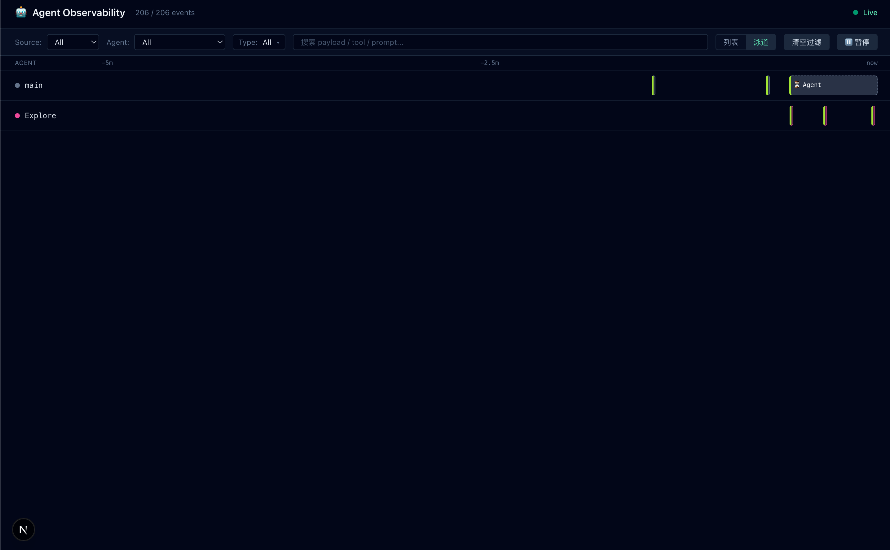
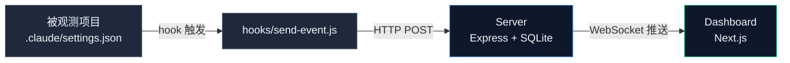

# Claude Code Observability

> 看见每一次工具调用、每一个子 agent、每一段等待——尽在一图。

[Claude Code](https://docs.claude.com/claude-code) 多 agent 会话的本地可观测性面板。Hook 实时捕获工具调用、prompt、子 agent 活动；前端渲染为实时事件流和 5 分钟滚动泳道视图。

> ⚠️ 英文版 [README.md](README.md) 是主版本。中文翻译可能滞后于英文版。

[English / 英文版](README.md)



*泳道视图：每个 agent 一行，时间从左到右流动。*

## 功能

- **实时事件流** — WebSocket 推送，无轮询。Hook 触发到面板渲染亚秒级延迟。
- **双视图** — 纵向列表（按时间顺序读）和横向泳道（5 分钟滚动窗口，看多 agent 协作）。
- **工具调用 Pre/Post 配对** — `PreToolUse` + `PostToolUse` 自动合并为一行，带耗时。运行中的工具有实时计时器。
- **子 agent 可见性** — `SubagentStart` / `SubagentStop` 自动配对为一行,显示总时长。
- **多维过滤** — 按 source app、agent 名、事件类型筛选,跨 payload 全文搜索。
- **暂停与缓冲** — 冻结事件流查看详情,恢复时显示暂停期间累积了多少事件。
- **Server 重启自愈** — 基于 SQLite 的事件存储,启动时重建 session→agent 映射。
- **本地优先设计** — 无云端、无认证、无遥测。仅监听 localhost 端口。

## 快速开始

**前置条件**：Node 20+、pnpm 9+、Claude Code CLI。

```bash
# 1. 克隆 + 安装
git clone https://github.com/Rossini402/claude-code-obs.git
cd claude-code-obs
pnpm install

# 2. 启动 server(端口 4000)+ 前端(端口 16000)
pnpm dev

# 3. 把要被观测的 Claude Code 项目的 hook 接到 server
# 复制示例 hook 配置:
cp .claude/settings.example.json /your/observed/project/.claude/settings.json
# 替换占位符 /ABSOLUTE/PATH/TO/claude-code-obs 和 YOUR_PROJECT
```

打开 `http://localhost:16000`,在被观测项目里启动一次 Claude Code 会话,事件会实时出现。

> 包含 12 种事件类型的完整 hook 配置说明:参见 [`.claude/README.md`](.claude/README.md)。

## 架构



**Hooks** 捕获所有 Claude Code 事件(12 种:工具调用、prompt、子 agent、权限请求等),以 JSON 形式 POST 到 server。

**Server** 把事件持久化到 SQLite(启用 WAL + 索引),并通过 WebSocket 广播给所有连接的 dashboard。

**Dashboard** 维护单一数据源(事件流),按需渲染为列表或泳道视图。

完整的事件 schema 和 agent 推断规则参见 [`docs/02-event-schema.md`](docs/02-event-schema.md)。

## 技术栈

| 层 | 工具 |
|------|------|
| Server | Node 20+、Express 5、better-sqlite3、ws |
| Dashboard | Next.js 15、React 19、Tailwind v4、TypeScript |
| Hooks | 纯 CommonJS(无转译,无依赖) |
| 工作区 | pnpm workspaces、Biome(lint + 格式化) |

## 路线图

### ✅ 已完成

- v1:列表视图、泳道视图、Pre/Post 配对、子 agent 配对、过滤、暂停缓冲。

### 🚧 进行中

- 清理 lint 历史债(参见 [`docs/TODO-lint-debt.md`](docs/TODO-lint-debt.md))。

### 🤔 在考虑

- `UserPromptSubmit` 装饰层(贯穿所有泳道行的竖直标记)。
- 跨泳道连接线(如 `main → Explore` 体现子 agent 调度关系)。
- 可调泳道窗口大小(30 秒 / 5 分钟 / 30 分钟切换)。
- 自由滚动时间轴(拖拽查看当前窗口外的历史)。
- 跨 session 关联视图(不同 Claude Code 会话之间的关系可视化)。

### ❌ 不会做

- 云托管版本。本工具按本地优先原则设计;如果你需要多用户可观测性,建议另选技术栈。
- 认证或访问控制。Server 只绑定 localhost;安全是操作系统的工作。
- 回放或时间旅行调试。本面板读实时事件;做事后分析请直接查 SQLite。

## 致谢

本项目的架构受 [**claude-code-hooks-multi-agent-observability**](https://github.com/disler/claude-code-hooks-multi-agent-observability)(作者 [@disler](https://github.com/disler))启发。

原项目奠定了"用 Claude Code hook 抽取事件 → 通过 HTTP/WebSocket 桥接 → 浏览器面板可视化"这一模式。

本项目是在不同技术栈下的重新实现,UX 重点也有调整:

| 维度 | 原项目 | 本项目 |
|------|--------|--------|
| Hook 脚本 | Python + uv | Node.js (CommonJS) |
| Server | Bun | Express + Node |
| 前端 | Vue 3 | Next.js + React |
| 主视图 | 事件时间线 | Agent 泳道 |
| Pre/Post 配对 | — | 是,带运行中计时 |

如果本项目对你有帮助,也欢迎给原项目点 star。

## 许可

MIT — 详见 [LICENSE](LICENSE)。
